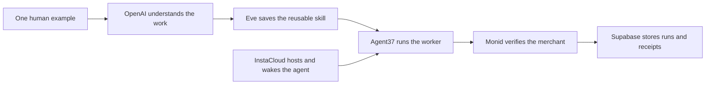

<div align="center">

# last time.

### Show it once. Get your afternoon back.

**A tiny AI work crew that learns the repetitive task you hate, runs it for you, and asks before making a risky decision.**

[Try the live product](https://lasttime-umber.vercel.app/teach) · [See the proof](https://lasttime-umber.vercel.app/activity) · [View the code](https://github.com/taranggoyal70/lasttime)


</div>

---

## The annoying problem

Every week, people repeat the same small workflows: match receipts, chase follow-ups, turn meeting notes into tasks, build reports, and clean up files.

Traditional automation makes you design the workflow first. **LastTime learns by watching one good example.**

## How it works

| 1. Show it | 2. Teach the judgment | 3. Get your time back |
|---|---|---|
| Complete the task once while your crew watches. | When the answer is unclear, LastTime asks instead of guessing. | The learned workflow runs again through a persistent agent. |

The default demo clears an expense receipt from an inbox, finds the matching card charge, adds it to a report, and pauses for one genuine policy decision.

## Why it is different

- **Learns from an example** — no flowchart builder or hundred-field setup form.
- **Asks at the edge cases** — uncertainty becomes a reusable rule, not a silent mistake.
- **Shows the paper trail** — every provider run has a real ID, timestamp, status, and cost when available.
- **Built as a product** — saved workflows, persistent runs, activity history, connections, and production storage.
- **Honest demo mode** — the 20-second showpiece is labeled; live provider data is never replaced with fake receipts.

## The product

| Screen | What it does |
|---|---|
| **Today** | Shows active work, completed runs, and time recovered. |
| **Teach** | Captures a real workflow or runs the fast stage demo. |
| **Workflows** | Holds the reusable jobs the crew has learned. |
| **Activity** | Shows workflow events and live sponsor receipts. |
| **Connections** | Reports which production services are actually reachable. |

## Real sponsor usage



| Sponsor | What LastTime actually uses it for | Proof shown in the app |
|---|---|---|
| **Agent37** | Runs persistent workers and approved workflow jobs. | Instance and session IDs. |
| **OpenAI** | Understands examples and turns actions into reusable workflow instructions. | Model and response receipt once connected. |
| **Supabase** | Stores workflows, runs, events, and integration receipts behind RLS. | Live database health and stored receipts. |
| **Monid** | Verifies merchants and entities before a worker acts. | Paid run ID, endpoint, status, and cost. |
| **InstaCloud** | Hosts the full agent runtime and triggers scheduled wake-ups. | Project, deployment, and wake receipt. |

## Run locally

```bash
git clone https://github.com/taranggoyal70/lasttime.git
cd lasttime
npm install --prefix engine
cp engine/.env.example engine/.env.local
```

Start the durable agent and product server in separate terminals:

```bash
npm run dev:engine
npm run dev:web
```

Open the deployed product at [lasttime-umber.vercel.app/teach](https://lasttime-umber.vercel.app/teach).

The interface stays honest when a service is missing: unavailable integrations remain gray and the live agent path stays disabled until it is ready.

## Environment

Keep these values in `engine/.env.local`. That file is ignored by Git.

```dotenv
AGENT37_API_KEY=
AGENT37_INSTANCE_ID=
MONID_API_KEY=
OPENAI_API_KEY=
SUPABASE_URL=
SUPABASE_SERVICE_ROLE_KEY=
INSTA_CRON_SECRET=
```

Apply [`supabase/migrations/20261007221500_initial_lasttime.sql`](supabase/migrations/20261007221500_initial_lasttime.sql) to a Supabase project before enabling production storage.

## Demo in three minutes

1. Open **Teach** and run the 20-second expense demo.
2. Let the crew complete the obvious steps and stop at the dinner-policy decision.
3. Answer once, resume the workflow, and download the completed report.
4. Open **Activity** to show the actual Agent37 and Monid receipts.
5. Open **Connections** to show that Supabase and InstaCloud are live dependencies.

## Stack

`JavaScript` · `TypeScript` · `Eve` · `OpenAI` · `Agent37` · `Monid` · `Supabase` · `InstaCloud` · `Vercel`

---

<div align="center">
  Built for the <strong>Build an Agent Hackathon</strong> on October 7, 2026.
</div>
